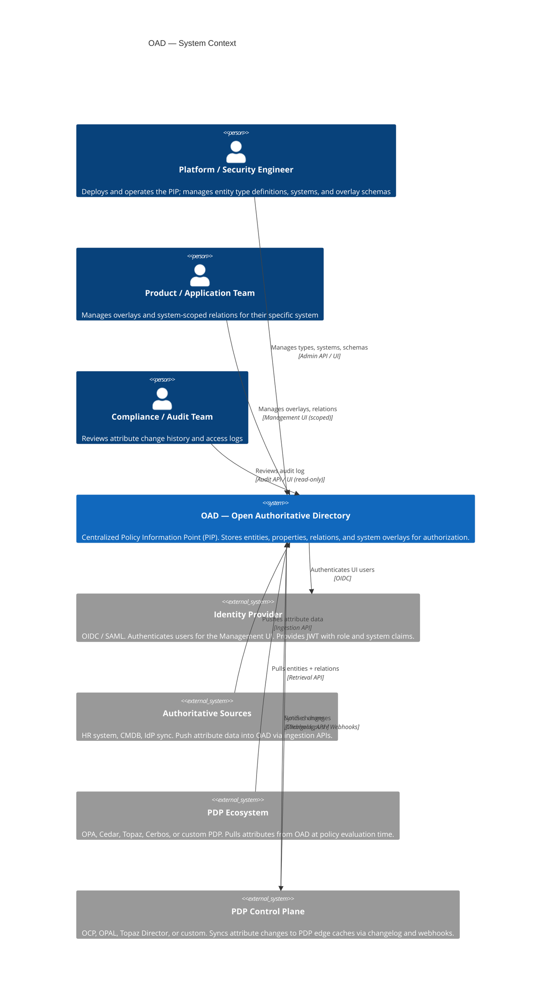
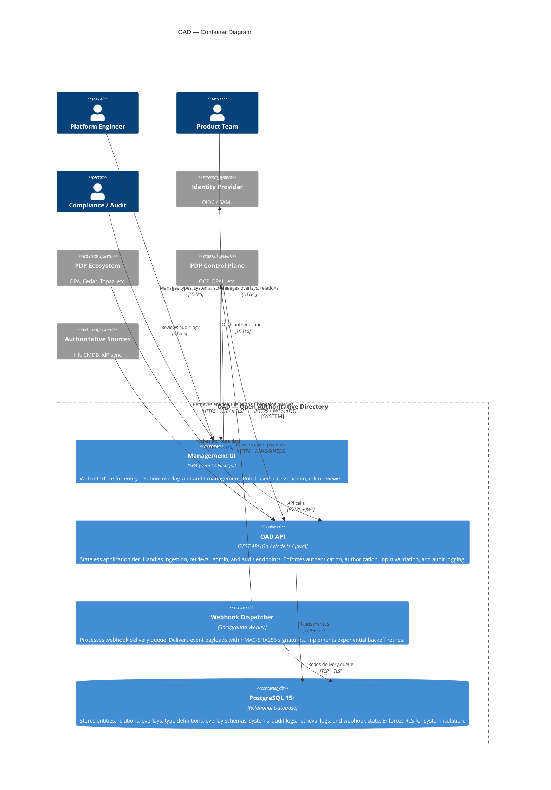
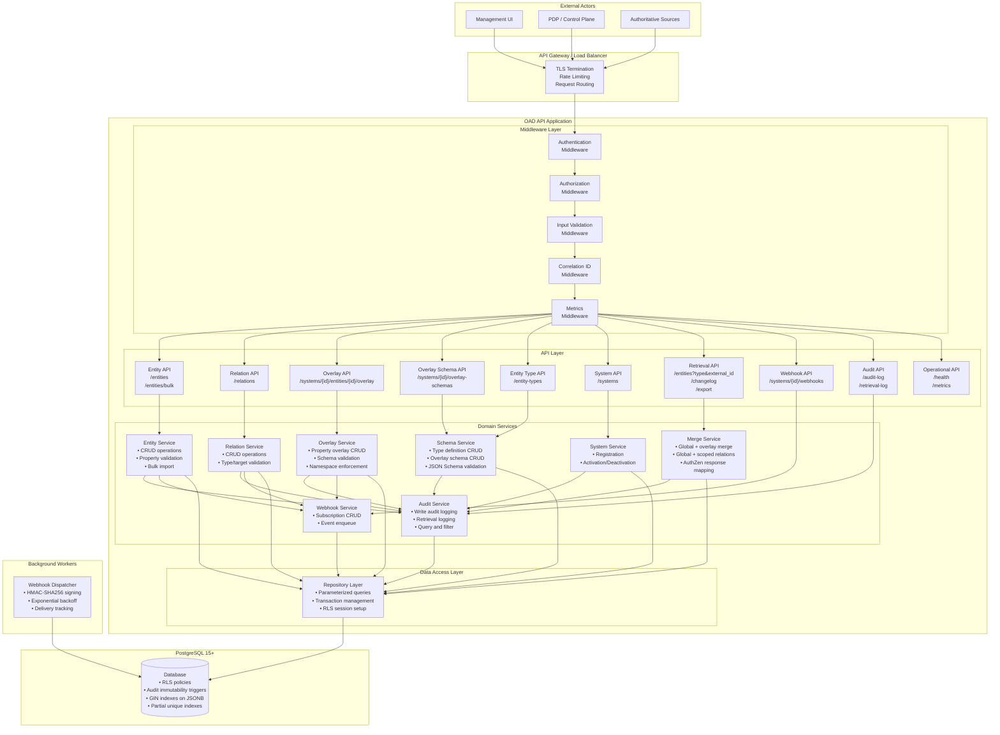
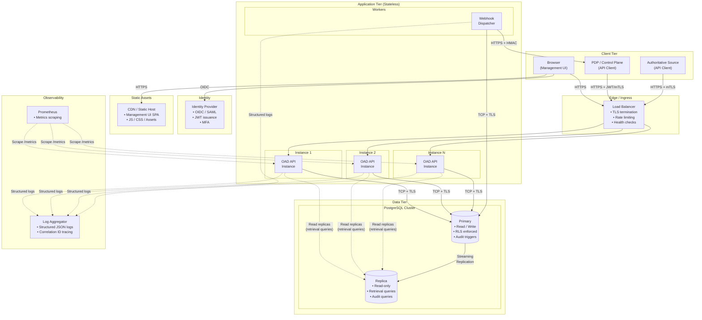
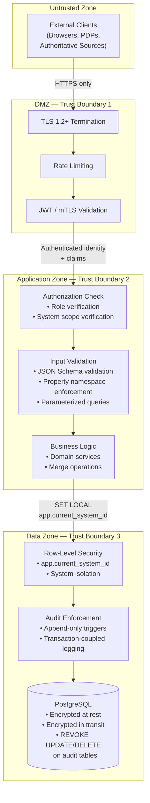

# OAD — Component & Deployment Diagram (v0.1)

> Derived from the [Product Specification](spec.md), [Requirements](requirements.md), [Data Model](data-model.md), and [Sequence Diagrams](sequence-diagrams.md). All diagrams use Mermaid syntax for GitHub-native rendering.

---

## 1. System Context Diagram

Shows OAD as a whole and its relationships with external actors and systems. OAD is the PIP (Policy Information Point) — it stores and serves authorization attributes. It does **not** evaluate policies (PDP), enforce decisions (PEP), or manage policies (PAP).

---

## 2. Container Diagram

Zooms into OAD, showing the major containers (deployable units) and their responsibilities.

---

## 3. Component Diagram

Breaks down the OAD API container into internal components, showing responsibilities and interactions.

---

## 4. Deployment Diagram

Shows the physical deployment topology for a production environment.

---

## 5. API Surface Map

Summary of all API groups, their consumers, and authentication requirements.

| API Group | Base Path | Primary Consumer | Auth Method | Description |
|---|---|---|---|---|
| **Entity Type API** | `/entity-types` | Platform Engineer (UI/API) | JWT (admin role) | CRUD for entity type definitions |
| **System API** | `/systems` | Platform Engineer (UI/API) | JWT (admin role) | Register, update, deactivate systems |
| **Overlay Schema API** | `/systems/{id}/overlay-schemas` | Platform Engineer (UI/API) | JWT (admin role) | Declare overlay schemas per system + type |
| **Entity API** | `/entities`, `/entities/bulk` | Platform Engineer, Product Team, Authoritative Sources | JWT / mTLS | CRUD and bulk import for entities |
| **Relation API** | `/relations` | Product Team, Platform Engineer | JWT / mTLS | CRUD for relations (global and system-scoped) |
| **Overlay API** | `/systems/{id}/entities/{id}/overlay` | Product Team | JWT (system-scoped) | Manage property overlays |
| **Retrieval API** | `/entities?type&external_id&system` | PDP / Control Plane | JWT / mTLS | Entity lookup with merged view |
| **Relation Query API** | `/entities/{id}/relations` | PDP / Control Plane | JWT / mTLS | Query entity relations |
| **Changelog API** | `/changelog` | PDP Control Plane | JWT / mTLS | Incremental sync since timestamp |
| **Export API** | `/export` | PDP Control Plane | JWT / mTLS | Paginated bulk export |
| **Webhook API** | `/systems/{id}/webhooks` | PDP Control Plane | JWT / mTLS | Subscription management |
| **Audit API** | `/audit-log`, `/retrieval-log` | Platform Engineer, Compliance | JWT | Query immutable audit trail |
| **Operational API** | `/health`, `/metrics` | Load Balancer, Prometheus | None / Internal | Health checks, Prometheus metrics |

---

## 6. Security Boundary Map

Visualizes the trust boundaries and security controls at each layer.

### Trust Boundary Controls

| Boundary | Controls | Threats Mitigated |
|---|---|---|
| **TB-1: DMZ** | TLS termination, rate limiting, JWT signature / mTLS certificate validation | Eavesdropping, replay attacks, credential stuffing, DDoS |
| **TB-2: Application** | Role-based authorization, system-scope verification, JSON Schema validation, namespace enforcement, parameterized queries | Privilege escalation, unauthorized cross-system access, attribute pollution, injection attacks (SQLi, XSS) |
| **TB-3: Data** | Row-Level Security, append-only audit triggers, REVOKE on audit tables, encryption at rest | Data leakage across systems, audit tampering, unauthorized data modification |

---

## 7. Design Decisions

### 7.1 Stateless application tier

All API instances are stateless — no session state, no local file dependencies. Any instance can serve any request. This enables horizontal scaling behind a load balancer and simplifies zero-downtime deployments (NFR-AVL-001).

### 7.2 Read replicas for retrieval queries

PDP retrieval queries (entity lookup, relation query, changelog) are read-heavy and latency-sensitive (NFR-PRF-001: p99 < 100ms). Routing these queries to read replicas distributes the load away from the primary, which handles writes and audit logging. The application detects query type and routes accordingly.

### 7.3 Webhook dispatcher as a separate worker

The webhook dispatcher runs as a separate process (not inline with API requests) to avoid:
- **Increased write latency** — webhook delivery should not block the API response.
- **Retry complexity in the request path** — exponential backoff requires durable state and asynchronous scheduling.
- **Failure coupling** — a subscriber endpoint timeout should not affect API availability.

The dispatcher reads from the `webhook_delivery` table and processes pending/failed deliveries independently.

### 7.4 CDN for Management UI

The Management UI is a single-page application served from a CDN or static host. All data operations go through the OAD API with JWT authentication. This keeps the UI deployment independent of the API tier and eliminates server-side rendering concerns.

### 7.5 No PDP-specific sync layer

OAD exposes generic APIs (changelog, bulk export, webhooks). Each PDP ecosystem brings its own sync mechanism:
- **OPA** → OCP fetches bundles via changelog API
- **Topaz** → Director syncs via changelog API
- **OPAL** → Data fetchers call retrieval API
- **Cedar** → Custom adapter calls retrieval API
- **Cerbos** → Webhook-triggered refresh

This keeps OAD PDP-agnostic (spec §5, architectural decision).

---

## Revision History

| Version | Date | Changes |
|---|---|---|
| 0.1 | 2026-04-10 | Initial draft — system context, container, component, deployment, and security boundary diagrams; API surface map; design decisions |
