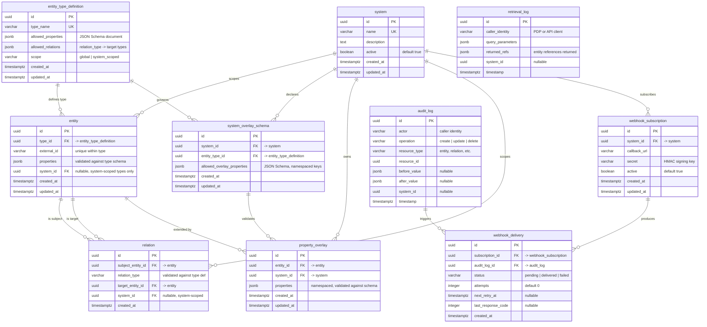

# OAD — Data Model (v0.2)

> Derived from the [Product Specification](spec.md) and [Requirements](requirements.md). All tables target PostgreSQL 15+.

---

## 1. Entity-Relationship Diagram



---

## 2. Table Definitions

### 2.1 `entity_type_definition`

Schema registry for entity types. Controls what entities can exist and constrains their structure at the ingestion boundary.

| Column | Type | Constraints | Description |
|---|---|---|---|
| `id` | `uuid` | PK, default `gen_random_uuid()` | Internal identifier. |
| `type_name` | `varchar(100)` | UNIQUE, NOT NULL | Logical name (`user`, `role`, `document`). Used as the entity type reference throughout the system. |
| `allowed_properties` | `jsonb` | NOT NULL | JSON Schema document that validates entity properties of this type. |
| `allowed_relations` | `jsonb` | NOT NULL | Declares valid `relation_type` values and their allowed target entity types. Structure: `{"member": {"target_types": ["group", "role"]}}`. |
| `scope` | `varchar(20)` | NOT NULL, CHECK (`global`, `system_scoped`) | Whether entities of this type exist globally or only within a system. |
| `created_at` | `timestamptz` | NOT NULL, default `now()` | Creation timestamp. |
| `updated_at` | `timestamptz` | NOT NULL, default `now()` | Last modification timestamp. |

**Requirement traceability:** FR-ETD-001, FR-ETD-002, FR-ETD-003, FR-ETD-004, NFR-EXT-001.

### 2.2 `system`

Registered applications whose authorization data is managed in OAD. Defines the management boundary for product teams.

| Column | Type | Constraints | Description |
|---|---|---|---|
| `id` | `uuid` | PK, default `gen_random_uuid()` | Internal identifier. |
| `name` | `varchar(200)` | UNIQUE, NOT NULL | Human-readable system name. |
| `description` | `text` | | Optional description of the system. |
| `active` | `boolean` | NOT NULL, default `true` | Inactive systems have their overlays excluded from retrieval responses. |
| `created_at` | `timestamptz` | NOT NULL, default `now()` | Creation timestamp. |
| `updated_at` | `timestamptz` | NOT NULL, default `now()` | Last modification timestamp. |

**Requirement traceability:** FR-SYS-001, FR-SYS-002, FR-SYS-003.

### 2.3 `entity`

A typed node in the authorization graph. Represents subjects, resources, roles, permissions, groups, or any other typed object.

| Column | Type | Constraints | Description |
|---|---|---|---|
| `id` | `uuid` | PK, default `gen_random_uuid()` | Internal identifier. |
| `type_id` | `uuid` | FK → `entity_type_definition.id`, NOT NULL | The entity's type. Determines property validation schema and allowed relations. |
| `external_id` | `varchar(500)` | NOT NULL | Identifier from the source system (employee ID, resource ARN, etc.). |
| `properties` | `jsonb` | NOT NULL, default `'{}'` | Global attributes. Validated against `entity_type_definition.allowed_properties` on every write. |
| `system_id` | `uuid` | FK → `system.id`, nullable | Set only for entities whose type has `scope = system_scoped`. NULL for global entities. |
| `created_at` | `timestamptz` | NOT NULL, default `now()` | Creation timestamp. |
| `updated_at` | `timestamptz` | NOT NULL, default `now()` | Last modification timestamp. |

**Unique constraint:** `(type_id, external_id)` — an external ID is unique within its entity type.

**Conditional constraint:** When `entity_type_definition.scope = 'system_scoped'`, `system_id` must not be null (enforced via application-level validation or a CHECK constraint with a subquery trigger).

**Requirement traceability:** FR-ENT-001 through FR-ENT-008.

### 2.4 `system_overlay_schema`

Declares which overlay properties a specific system is allowed to attach to entities of a given type. Acts as a schema registry for overlays, analogous to how `entity_type_definition` governs global entity properties.

| Column | Type | Constraints | Description |
|---|---|---|---|
| `id` | `uuid` | PK, default `gen_random_uuid()` | Internal identifier. |
| `system_id` | `uuid` | FK → `system.id`, NOT NULL | The system this schema applies to. |
| `entity_type_id` | `uuid` | FK → `entity_type_definition.id`, NOT NULL | The entity type this schema governs. |
| `allowed_overlay_properties` | `jsonb` | NOT NULL | JSON Schema document that validates overlay properties. All declared property keys must be prefixed with the system's name (e.g., `credit.max_approval`). |
| `created_at` | `timestamptz` | NOT NULL, default `now()` | Creation timestamp. |
| `updated_at` | `timestamptz` | NOT NULL, default `now()` | Last modification timestamp. |

**Unique constraint:** `(system_id, entity_type_id)` — one overlay schema per system per entity type.

**Namespace enforcement:** The application layer validates at write time that every property key in `allowed_overlay_properties` starts with `{system.name}.` (e.g., `credit.`). This is a boundary validation, not a database constraint, because the system name is resolved via join.

**Requirement traceability:** FR-OVS-001 through FR-OVS-005.

### 2.5 `relation`

A typed, directed edge between two entities. The building block for RBAC and ReBAC.

| Column | Type | Constraints | Description |
|---|---|---|---|
| `id` | `uuid` | PK, default `gen_random_uuid()` | Internal identifier. |
| `subject_entity_id` | `uuid` | FK → `entity.id`, NOT NULL, ON DELETE CASCADE | The source entity of the relation. |
| `relation_type` | `varchar(100)` | NOT NULL | The kind of edge (`member`, `owner`, `viewer`, `grants`). Validated against the subject entity's type definition. |
| `target_entity_id` | `uuid` | FK → `entity.id`, NOT NULL, ON DELETE CASCADE | The target entity of the relation. |
| `system_id` | `uuid` | FK → `system.id`, nullable | When set, the relation exists only within this system's scope. NULL means the relation is global. |
| `created_at` | `timestamptz` | NOT NULL, default `now()` | Creation timestamp. |

**Unique constraint:** `(subject_entity_id, relation_type, target_entity_id, system_id)` — prevents duplicate relations. Uses a partial unique index for the NULL `system_id` case.

**Requirement traceability:** FR-REL-001 through FR-REL-005, FR-OVL-002.

### 2.6 `property_overlay`

System-specific properties layered on top of a global entity. When a PDP requests an entity within a system context, global properties are merged with the namespaced overlay properties (no key collisions by design).

| Column | Type | Constraints | Description |
|---|---|---|---|
| `id` | `uuid` | PK, default `gen_random_uuid()` | Internal identifier. |
| `entity_id` | `uuid` | FK → `entity.id`, NOT NULL, ON DELETE CASCADE | The global entity being extended. |
| `system_id` | `uuid` | FK → `system.id`, NOT NULL | The system that owns this overlay. |
| `properties` | `jsonb` | NOT NULL, default `'{}'` | System-specific properties with namespaced keys (e.g., `credit.max_approval`). Validated against `system_overlay_schema.allowed_overlay_properties` on every write. Merged with `entity.properties` on retrieval. |
| `created_at` | `timestamptz` | NOT NULL, default `now()` | Creation timestamp. |
| `updated_at` | `timestamptz` | NOT NULL, default `now()` | Last modification timestamp. |

**Unique constraint:** `(entity_id, system_id)` — one overlay per entity per system.

**Requirement traceability:** FR-OVL-001, FR-OVL-002, FR-OVL-003, FR-OVL-004, FR-OVL-006, FR-OVL-008.

### 2.7 `webhook_subscription`

Event notification subscriptions. Consumers register a callback URL to receive change events for a specific system.

| Column | Type | Constraints | Description |
|---|---|---|---|
| `id` | `uuid` | PK, default `gen_random_uuid()` | Internal identifier. |
| `system_id` | `uuid` | FK → `system.id`, NOT NULL | The system whose changes trigger notifications. |
| `callback_url` | `varchar(2000)` | NOT NULL | The URL to POST event payloads to. |
| `secret` | `varchar(500)` | NOT NULL | Shared secret for HMAC-SHA256 signature of webhook payloads, enabling receivers to verify authenticity. |
| `active` | `boolean` | NOT NULL, default `true` | Inactive subscriptions do not receive deliveries. |
| `created_at` | `timestamptz` | NOT NULL, default `now()` | Creation timestamp. |
| `updated_at` | `timestamptz` | NOT NULL, default `now()` | Last modification timestamp. |

**Requirement traceability:** FR-WHK-001, FR-WHK-003.

### 2.8 `webhook_delivery`

Tracks individual delivery attempts for webhook notifications. Supports retry with exponential backoff.

| Column | Type | Constraints | Description |
|---|---|---|---|
| `id` | `uuid` | PK, default `gen_random_uuid()` | Internal identifier. |
| `subscription_id` | `uuid` | FK → `webhook_subscription.id`, NOT NULL | The subscription this delivery belongs to. |
| `audit_log_id` | `uuid` | FK → `audit_log.id`, NOT NULL | The audit log entry that triggered this notification. |
| `status` | `varchar(20)` | NOT NULL, CHECK (`pending`, `delivered`, `failed`) | Current delivery status. |
| `attempts` | `integer` | NOT NULL, default `0` | Number of delivery attempts made. |
| `next_retry_at` | `timestamptz` | | Next scheduled retry. NULL when delivered or max retries exhausted. |
| `last_response_code` | `integer` | | HTTP status code from the most recent delivery attempt. |
| `created_at` | `timestamptz` | NOT NULL, default `now()` | Creation timestamp. |

**Requirement traceability:** FR-WHK-002, FR-WHK-004.

### 2.9 `audit_log`

Immutable record of every write operation. No UPDATE or DELETE is permitted on this table.

| Column | Type | Constraints | Description |
|---|---|---|---|
| `id` | `uuid` | PK, default `gen_random_uuid()` | Internal identifier. |
| `actor` | `varchar(500)` | NOT NULL | Identity of the caller who performed the operation (JWT subject or mTLS CN). |
| `operation` | `varchar(20)` | NOT NULL, CHECK (`create`, `update`, `delete`) | Type of mutation. |
| `resource_type` | `varchar(100)` | NOT NULL | The kind of resource affected (`entity`, `relation`, `property_overlay`, `system_overlay_schema`, `entity_type_definition`, `system`, `webhook_subscription`). |
| `resource_id` | `uuid` | NOT NULL | The primary key of the affected resource. |
| `before_value` | `jsonb` | | Snapshot of the resource before the operation. NULL for `create`. |
| `after_value` | `jsonb` | | Snapshot of the resource after the operation. NULL for `delete`. |
| `system_id` | `uuid` | | System context of the operation, when applicable. Not a FK to avoid coupling audit immutability to system lifecycle. |
| `timestamp` | `timestamptz` | NOT NULL, default `now()` | When the operation occurred. Millisecond precision, UTC. |

**Immutability enforcement:** REVOKE UPDATE, DELETE on `audit_log` from application roles. A database trigger rejects any UPDATE or DELETE attempt.

**Requirement traceability:** FR-AUD-001, FR-AUD-003, FR-AUD-004, NFR-AUD-001, NFR-AUD-002.

### 2.10 `retrieval_log`

Record of every retrieval event for compliance. Separate from `audit_log` because the structure differs (no before/after values; instead, query parameters and returned references).

| Column | Type | Constraints | Description |
|---|---|---|---|
| `id` | `uuid` | PK, default `gen_random_uuid()` | Internal identifier. |
| `caller_identity` | `varchar(500)` | NOT NULL | Identity of the PDP or API client that made the request. |
| `query_parameters` | `jsonb` | NOT NULL | The parameters used in the retrieval request (type, external_id, system, filters). |
| `returned_refs` | `jsonb` | NOT NULL | References to entities and relations returned in the response. |
| `system_id` | `uuid` | | System context of the query, when applicable. |
| `timestamp` | `timestamptz` | NOT NULL, default `now()` | When the retrieval occurred. |

**Immutability enforcement:** Same as `audit_log` — REVOKE UPDATE, DELETE; reject via trigger.

**Requirement traceability:** FR-AUD-002, FR-AUD-003, NFR-AUD-001.

---

## 3. Indexes

### 3.1 Primary Access Patterns

| Table | Index | Type | Purpose | Req |
|---|---|---|---|---|
| `entity` | `(type_id, external_id)` | UNIQUE B-tree | Entity lookup by type + external ID — the primary retrieval path. | FR-RET-001 |
| `entity` | `properties` | GIN | Filtered queries on dynamic properties (`WHERE properties @> '{"department":"ops"}'`). | FR-RET-002 |
| `entity` | `(system_id)` | B-tree | Filter entities by system scope. | FR-OVL-003 |
| `relation` | `(subject_entity_id, relation_type)` | B-tree | "All relations where entity X is the subject, filtered by type." | FR-REL-005 |
| `relation` | `(target_entity_id, relation_type)` | B-tree | Reverse lookup — "who is related to entity Y?" | FR-REL-005 |
| `relation` | `(subject_entity_id, relation_type, target_entity_id, system_id)` | UNIQUE B-tree | Duplicate prevention. Partial index for NULL `system_id`. | FR-REL-003 |
| `system_overlay_schema` | `(system_id, entity_type_id)` | UNIQUE B-tree | One overlay schema per system per entity type; lookup during overlay validation. | FR-OVS-001 |
| `property_overlay` | `(entity_id, system_id)` | UNIQUE B-tree | One overlay per entity per system; fast lookup for merge. | FR-OVL-001 |

### 3.2 Audit and Changelog

| Table | Index | Type | Purpose | Req |
|---|---|---|---|---|
| `audit_log` | `(timestamp)` | B-tree | Changelog endpoint — "what changed since T?" | FR-RET-003 |
| `audit_log` | `(resource_type, resource_id)` | B-tree | Audit history for a specific resource. | FR-AUD-004 |
| `audit_log` | `(actor)` | B-tree | Filter audit entries by actor. | FR-AUD-004 |
| `audit_log` | `(system_id, timestamp)` | B-tree | Audit entries filtered by system and time range. | FR-AUD-004 |
| `retrieval_log` | `(timestamp)` | B-tree | Time-range queries on retrieval history. | FR-AUD-004 |
| `retrieval_log` | `(caller_identity, timestamp)` | B-tree | Retrieval history by PDP identity. | FR-AUD-002 |

### 3.3 Webhook Processing

| Table | Index | Type | Purpose | Req |
|---|---|---|---|---|
| `webhook_delivery` | `(status, next_retry_at)` | B-tree | Retry worker query — find pending/failed deliveries due for retry. | FR-WHK-004 |
| `webhook_delivery` | `(subscription_id, created_at)` | B-tree | Delivery history for a subscription. | FR-WHK-003 |

---

## 4. Design Decisions

### 4.1 `type_id` (UUID FK) vs `type` (string) on `entity`

The spec defines `entity.type` as a string, but the data model uses a UUID FK (`type_id`) to `entity_type_definition.id`. Rationale:

- **Referential integrity** — the database enforces that every entity references a valid type definition. An entity cannot exist with an undeclared type (FR-ENT-008).
- **Cascade-safe** — renaming a `type_name` does not require updating every entity row.
- **Join efficiency** — UUID joins are faster than varchar joins on large datasets.

The application layer resolves `type_name` for API responses and AuthZen mapping.

### 4.2 Separate `property_overlay` table vs inline JSONB

Property overlays are stored in a dedicated table rather than as a JSONB array on `entity` because:

- **Isolation** — RLS policies can restrict overlay access by `system_id` independently of entity access.
- **Write contention** — overlays for different systems do not compete for row-level locks on the same entity row.
- **Merge semantics** — the retrieval API performs `entity.properties || property_overlay.properties` (PostgreSQL JSONB merge) at query time, producing the merged view without denormalization. Because overlay keys are namespaced (e.g., `credit.max_approval`), the merge is a union of disjoint key sets — no conflict resolution needed.

### 4.3 System overlay schema and namespace convention

Overlay properties are governed by two complementary mechanisms:

**Schema validation (Option B)** — the `system_overlay_schema` table declares, per system + entity type combination, which overlay properties are allowed and their data types (via JSON Schema). This prevents:
- **Attribute pollution** — a system admin cannot inject arbitrary properties into entities.
- **Type mismatches** — a PDP will not receive a string where it expects an integer.
- **Unauthorized property injection** — an attacker with compromised system credentials is constrained to declared properties.

**Namespace prefixing (Option C)** — all overlay property keys must be prefixed with the owning system's name (e.g., `credit.max_approval`, `hr.cost_center`). This prevents:
- **Key collisions with global properties** — global properties use unprefixed keys (`clearance`, `department`); overlay keys are always prefixed, so the sets are disjoint by construction.
- **Cross-system ambiguity** — when viewing a merged entity, the source system of each overlay property is immediately visible.
- **Merge conflicts** — the merge operation becomes a simple `||` (JSONB concatenation) because key uniqueness is guaranteed by namespace.

The namespace is enforced at the application boundary (ingestion API) rather than as a database constraint, because validation requires resolving the system name via a join to the `system` table.

### 4.4 Separate `audit_log` and `retrieval_log` tables

Write audits and read audits have different structures (before/after values vs. query parameters). Splitting them avoids sparse columns and allows independent retention policies — retrieval logs are typically higher volume and may have a shorter retention window.

### 4.5 `audit_log.system_id` is not a FK

The `system_id` column in `audit_log` and `retrieval_log` is intentionally not a foreign key. If a system is deleted or deactivated, its audit history must remain intact and queryable. A FK with ON DELETE SET NULL would lose the association; a FK with ON DELETE RESTRICT would prevent system cleanup. Storing the value without a FK constraint preserves the audit trail unconditionally.

### 4.6 Relation uniqueness with nullable `system_id`

PostgreSQL treats NULL != NULL in unique constraints, which would allow duplicate global relations (where `system_id` is NULL). This is solved with two partial unique indexes:

```sql
-- Global relations (system_id IS NULL)
CREATE UNIQUE INDEX uq_relation_global
  ON relation (subject_entity_id, relation_type, target_entity_id)
  WHERE system_id IS NULL;

-- System-scoped relations (system_id IS NOT NULL)
CREATE UNIQUE INDEX uq_relation_scoped
  ON relation (subject_entity_id, relation_type, target_entity_id, system_id)
  WHERE system_id IS NOT NULL;
```

### 4.7 Row-Level Security (RLS) strategy

RLS is applied on `entity` (for system-scoped types), `relation`, `property_overlay`, and `webhook_subscription`. The application sets a session variable (`SET LOCAL app.current_system_id = '...'`) per request, and RLS policies filter rows automatically:

```sql
-- Example: property_overlay access restricted to the caller's system
ALTER TABLE property_overlay ENABLE ROW LEVEL SECURITY;
CREATE POLICY overlay_system_isolation ON property_overlay
  USING (system_id = current_setting('app.current_system_id')::uuid);
```

Platform administrators bypass RLS via a separate database role with `BYPASSRLS`.

### 4.8 Management UI access control

The management UI authenticates users via an external IdP (JWT). User roles (`admin`, `editor`, `viewer`) and system assignments are conveyed as JWT claims. This avoids a circular dependency where OAD would need to query itself for access control during authentication, and keeps the identity management responsibility with the IdP where it belongs.

---

## Revision History

| Version | Date | Changes |
|---|---|---|
| 0.1 | 2026-04-10 | Initial draft — ER diagram, table definitions, indexes, design decisions |
| 0.2 | 2026-04-10 | Add `system_overlay_schema` table; namespace enforcement for overlay property keys; update ER diagram, indexes, and design decisions |
