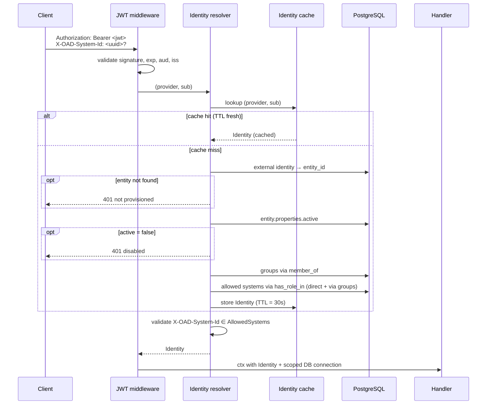

# OAD — DB-Authoritative Authorization (v0.1)

> Cross-references: [Spec](../spec.md), [Data Model](../data-model.md), [Backlog](../backlog.md), [SCIM Ingest](scim-ingest.md)
>
> Phase reference: **C** in the User Provisioning roadmap (Foundation A → SCIM B → DB-Authoritative C → Admin UI D).
>
> **Depends on:** Phase A schema deltas as documented in [SCIM Ingest §3](scim-ingest.md#3-schema-foundation-phase-a). Phase A must land first.

---

## 1. Goal and non-goals

### 1.1 Goal

Move authorization decisions for the OAD management plane from JWT custom claims (`oad_roles`, `oad_system_id`) to the entity / relation graph in PostgreSQL. After Phase C, the JWT proves identity only; everything else (group membership, system access, role) is resolved by lookup against `entity` and `relation` rows populated via SCIM (Phase B).

### 1.2 Non-goals

- **Not a change to PDP-facing APIs.** PDPs already consume the entity / relation graph via the retrieval API. This phase only changes the management-plane authentication path.
- **Not a change to the JWT validation library.** We continue using `lestrrat-go/jwx/v2` and the JWKS auto-refresh cache. We just stop reading custom claims.
- **Not a backward-compatibility phase.** OAD is pre-release; the legacy claim path is removed cleanly, with no transition flag.

---

## 2. Current state (claims-driven)

`internal/auth/jwt.go` parses the bearer token, validates against the JWKS, then extracts:

```go
type Identity struct {
    Subject  string     // sub claim
    Roles    []string   // from oad_roles claim (custom)
    SystemID *uuid.UUID // from oad_system_id claim (custom)
}
```

`internal/api/middleware/authz.go` reads `identity.Roles` for `RequireRole` checks. `db/scope.go` reads `identity.SystemID` to set the RLS session variable `app.current_system_id`.

The IdP is responsible for stuffing the right values into the JWT and for keeping them current. This is brittle:

- **Stale claims** — a token issued at 09:00 carries the user's 09:00 roles for its full lifetime. Revocation requires either short token TTLs (auth pressure) or a token denylist.
- **IdP coupling** — every IdP must be configured with the right claim emission rules, the right `claims_mapping` translation, and the right group-to-role logic.
- **Multi-system ambiguity** — a single user with access to multiple systems requires either a separate token per system or a stuffed array claim.

Phase B already populates the DB with this information. Phase C harvests it.

---

## 3. Target state

After Phase C:

```go
type Identity struct {
    Subject         string         // JWT sub (preserved for audit traceability)
    Provider        string         // matched auth.providers[].name
    EntityID        uuid.UUID      // entity.id of the User
    Groups          []string       // external_id of all Groups the user is member_of (transitive)
    AllowedSystems  []uuid.UUID    // entity.id of every System the user can access (direct or via group)
    IsPlatformAdmin bool           // true if oad:admin is in Groups
    ActiveSystemID  *uuid.UUID     // selected via X-OAD-System-Id header, validated against AllowedSystems
}
```

The `Identity` is rebuilt for every request (with caching, see §8), sourced from the entity / relation graph.

---

## 4. Request lifecycle



---

## 5. Identity resolution algorithm

1. **Authenticate JWT.** Validate signature against the JWKS of the issuing provider. Validate `aud`, `iss`, `exp`, `nbf`. Extract `sub`. Determine `provider` from the matching `auth.providers[]` entry (matched by `iss`).
2. **Cache lookup.** Key = `sha256(provider || ":" || sub)`. If hit and TTL fresh, return.
3. **Resolve entity.** `SELECT entity_id FROM entity_external_identity WHERE provider_name = ? AND external_subject = ?`. If no row, return `401 not provisioned` (see §10 for race-condition discussion).
4. **Check active flag.** Read `entity.properties.active`. If `false`, return `401 disabled`.
5. **Compute groups.** Resolve all groups the user is a member of, transitively. Initial scope: a single `member_of` hop (User → Group). If group-of-groups becomes supported in the future, this becomes a recursive CTE.
6. **Compute allowed systems.** Union of:
    - **Direct:** `relation` rows from `entity_id` with `relation_type = 'has_role_in'` and target type `System`.
    - **Via groups:** `relation` rows from any group ID resolved in step 5, same `relation_type` and target type.
7. **Set platform-admin flag.** True iff group `oad:admin` (resolved by `external_id`) is in the user's group set.
8. **Validate `X-OAD-System-Id` header.** If present:
    - Parse as UUID. Invalid → `400 Bad Request`.
    - Must be in `AllowedSystems`. Otherwise `403 Forbidden`. Platform admin bypasses (any system permitted).

   If absent and the route requires system scope, return `400 Missing X-OAD-System-Id`. If absent on a non-scoped route, leave nil.
9. **Set RLS variable.** When `ActiveSystemID` is set, `SET LOCAL app.current_system_id = ?` on the request's transaction (existing mechanism in `db/scope.go`).
10. **Cache Identity.** TTL = 30 seconds (configurable; see §8).

---

## 6. JWT contract

### 6.1 Required claims

| Claim | Use |
|---|---|
| `sub` | Stable identifier within issuer. Joined with provider to find external identity. |
| `iss` | Maps to provider via `auth.providers[].issuer`. |
| `aud` | Must include `auth.providers[].audience`. |
| `exp`, `iat` | Standard freshness. |
| `nbf` | Honored if present. |

### 6.2 Claims no longer read

| Claim | Disposition |
|---|---|
| `oad_roles` | **Ignored.** May still appear in tokens (IdPs may emit them); we do not read them. |
| `oad_system_id` | **Ignored.** System scope comes from the `X-OAD-System-Id` header, not the token. |

The `claims_mapping` block in YAML config becomes obsolete. The configuration loader stops accepting it; if present, startup fails with a clear error pointing to this design doc.

### 6.3 Token size

Tokens shrink. This is a side benefit — fewer custom claims means less leak surface and smaller header payloads.

---

## 7. Bootstrap admin mechanism

### 7.1 Problem

The first user logging in after a fresh deployment will not have an entity in the DB until SCIM provisions them. They cannot use the admin UI to set up SCIM, because they have no permissions. Chicken-and-egg.

### 7.2 Solution: bootstrap list in YAML

```yaml
auth:
  bootstrap_admins:
    - provider: keycloak
      subject: 4b3c2a1d-...   # JWT sub for the initial admin user
```

On startup, OAD ensures that for each `(provider, subject)` in this list:

1. An `entity` of type `User` exists, linked via `entity_external_identity`. Created if missing, with `active = true` and minimal properties (`displayName = "<bootstrap>"` until SCIM overwrites).
2. A `relation` exists: `entity --member_of--> oad:admin`.

Bootstrap entities are marked with `entity.properties.bootstrap = true` to distinguish them from SCIM-provisioned users in the admin UI. When SCIM later provisions the same user, SCIM data overwrites bootstrap properties; the `member_of oad:admin` relation persists until explicitly removed via the admin UI.

### 7.3 Lifecycle

- The bootstrap list is read on every startup.
- Adding a new entry creates the bootstrap user + relation.
- Removing an entry does **not** revoke admin. We deliberately reject this side-effect to avoid lockout from a config typo. Removal of admin must be done explicitly via the management plane.
- An audit log entry is written when bootstrap creates an entity or relation, with `actor = "system:bootstrap"`.

### 7.4 Initial provisioning recommended sequence

1. Deploy OAD with `bootstrap_admins` populated for one or two ops users.
2. Ops user logs in, configures SCIM provider in the IdP.
3. SCIM ingests the rest of the organization.
4. Ops user removes themselves from `bootstrap_admins` (optional; the bootstrap entry is a no-op once the entity exists).

---

## 8. Identity cache

### 8.1 Strategy

In-memory LRU per process. Keyed by `(provider, sub)`. Value = the resolved `Identity` struct (without `ActiveSystemID`, which is per-request).

| Parameter | Default | Override |
|---|---|---|
| TTL | 30 seconds | `OAD_IDENTITY_CACHE_TTL` |
| Capacity | 10,000 entries | `OAD_IDENTITY_CACHE_SIZE` |
| Backend | In-process LRU | (no override; multi-instance staleness capped at TTL) |

### 8.2 Why 30 seconds

Trade-off between freshness (Broken Access Control concerns) and DB load.

- **Worst-case staleness:** a revoked permission keeps working for up to 30 seconds after SCIM removes the relation.
- **DB load reduction:** for an instance with 1000 active users hitting the API at 10 RPS each, cache absorbs ~99% of identity lookups.

The TTL is configurable so security-critical deployments can lower it (5–10s) at the cost of more DB load. Multi-instance deployments inherit the TTL as the cap on cross-instance staleness because invalidation is in-process.

### 8.3 Invalidation

The cache is invalidated synchronously on:

- SCIM `PATCH` / `PUT` / `DELETE` on a User → invalidate by `(provider, sub)`.
- SCIM `PATCH` on a Group that adds/removes a member → invalidate the affected member's `(provider, sub)`.
- Direct admin-API mutation of a `relation` involving a User as subject → invalidate.
- Mutation of a `Group` (delete, rename) → invalidate all members.

Invalidation is best-effort within a single process. Multi-instance deployments accept the TTL as the cap on cross-instance staleness.

### 8.4 Cache poisoning protection

The cache key includes the provider name (resolved from JWT `iss`). A token from a different IdP with a colliding `sub` cannot read another IdP's user, because the lookup namespaces by provider before keying.

---

## 9. Multi-system context: the `X-OAD-System-Id` header

### 9.1 Selection

The client (UI or API consumer) sends `X-OAD-System-Id: <uuid>` to identify which system context the request operates in.

| Route group | Header expected? |
|---|---|
| `/api/v1/types/...` | No (global). |
| `/api/v1/systems/...` | No (system management is platform-admin scope). |
| `/api/v1/entities/...`, `/api/v1/relations/...`, `/api/v1/overlays/...` | Yes. |
| `/scim/v2/...` | No (SCIM data is global). |
| `/health`, `/metrics` | No. |

### 9.2 Validation

If the header is present:

- Parse as UUID. Invalid → `400 Bad Request`.
- Must equal an `entity.id` in the user's `AllowedSystems`. Otherwise `403 Forbidden`.
- Platform admins bypass (any well-formed system UUID accepted).

If the header is required but absent: `400 Missing X-OAD-System-Id`.

### 9.3 UI behavior

The Management UI maintains an "active system" in `localStorage`, populated from the `/me` endpoint (§16 Q3). The user picks via the `SystemScopeBanner` component (already present from Phase 7.4). The HTTP client interceptor in [http-client.ts](../../web/src/lib/http-client.ts) attaches the header automatically on every fetch — same shape as the existing `Authorization` interceptor.

---

## 10. Race conditions

| Race | Mitigation |
|---|---|
| User receives JWT before SCIM has provisioned them | Resolver returns `401 not provisioned`. UI surfaces an actionable message: "Your account is being provisioned. Try again in a moment." |
| Token issued, then user removed from group, then token used | Up to TTL staleness via cache. Acceptable per §8.2. SCIM PATCH triggers cache invalidation; only the window between PATCH and invalidation completion remains. |
| Token issued, then user disabled at IdP | Same TTL staleness. The IdP-side disable does not propagate to OAD until SCIM PATCH `active=false` arrives, then the cache is invalidated. |
| `bootstrap_admins` modified at runtime | Not honored until restart. The list is read once on startup. |
| Concurrent request from same `(provider, sub)` during cache miss | Each goroutine resolves independently and stores. Last writer wins. Storing the same value is idempotent; no correctness issue. Optional optimization: singleflight wrapper to deduplicate concurrent misses. |
| Cache invalidation from one process not seen by other processes | Multi-instance deployments tolerate this up to TTL. Documented as the staleness cap. |

### 10.1 Optional JIT fallback (deferred)

A JIT path that creates a User entity at first sight (with no group memberships, hence denied by all subsequent authz checks) is **not implemented in v1**. Trade-off: simpler UX (no "not provisioned" error visible to users) at the cost of a code path that creates entities outside the SCIM authoritative flow. We prefer the explicit error and revisit if user feedback warrants it.

---

## 11. Audit and retrieval log impact

### 11.1 Audit log

Existing behavior: every write operation logs `actor` (JWT sub or mTLS CN). After Phase C: `actor` is set to `"user:<entity.id>"` — the OAD `entity.id` (UUID), which is more stable across IdP migrations than the IdP's `sub`. The original `sub` is still preserved in `audit_log.before_value` / `after_value` when the operation modifies the user themselves.

### 11.2 Retrieval log

The identity resolver itself does several DB reads per cache miss. We do **not** log these as `retrieval_log` events — they are infrastructure reads on internal resources (entities of type User, Group, System), not policy-relevant queries from a PDP. `retrieval_log` continues to be written only by the PDP-facing retrieval API.

### 11.3 New audit event: `auth.bootstrap_admin_applied`

When the bootstrap routine creates a user or relation on startup, an `audit_log` entry is written with:

- `actor = "system:bootstrap"`
- `operation = "create"`
- `resource_type = "entity"` or `"relation"`
- `resource_id` set to the affected row.

---

## 12. Update to data-model.md §4.8

Section 4.8 ("Management UI access control") currently states:

> The management UI authenticates users via an external IdP (JWT). User roles (`admin`, `editor`, `viewer`) and system assignments are conveyed as JWT claims. This avoids a circular dependency where OAD would need to query itself for access control during authentication, and keeps the identity management responsibility with the IdP where it belongs.

This is replaced with:

> The management UI authenticates users via an external IdP (JWT). The JWT proves identity (`sub`, `iss`, `aud`); group membership and allowed systems are resolved from the entity / relation graph populated by SCIM ingest. The active system context for a request is conveyed via the `X-OAD-System-Id` HTTP header, validated against the user's allowed systems on every call. The historic concern about a circular dependency is addressed by the bootstrap admin mechanism (see [DB-Authoritative Auth §7](design/db-authoritative-auth.md#7-bootstrap-admin-mechanism)).

Update to be applied as part of sub-phase **C.5**.

---

## 13. Edge cases

| Case | Behavior |
|---|---|
| User belongs to `oad:admin` AND a customer-defined group | Platform admin status takes precedence. `IsPlatformAdmin = true`. |
| User has zero groups | `Identity` builds successfully but all permission checks deny. UI shows "no permissions assigned." |
| Provider in JWT `iss` does not match any configured provider | `401 unknown issuer`. |
| Token from one provider, but SCIM only ingested another provider for this user | No `entity_external_identity` for the JWT's provider → `401 not provisioned`. Cross-IdP merge (Phase D) creates the missing link. |
| Group `oad:admin` deleted (despite `is_builtin = true` guard) | Defense in depth: admin checks fall back to `false`. Platform admin access lost — must restore via direct DB intervention or by adding a fresh entry to `bootstrap_admins`. The `is_builtin` flag is the primary defense. |
| `entity.properties.active` is missing (legacy entity) | Treated as `active = true` for backward compatibility within the v1 release. Phase A migration ensures all seeded and SCIM-created users have this property set. |
| User has access to system A through group G1 and through group G2 | `AllowedSystems` is a set; A appears once. Direct + indirect access do not stack. |

---

## 14. Test plan

### 14.1 Unit tests

- **Identity resolver** — table-driven tests with stub repository for `entity` / `relation` / `entity_external_identity`.
- **Cache** — invalidation triggers, TTL expiry, capacity eviction. Concurrent miss with singleflight (if implemented).
- **JWT validation** — existing tests retained; new tests asserting `oad_roles` / `oad_system_id` are **not** consulted (a token with a forged admin role is denied).
- **Bootstrap routine** — empty DB → bootstrap list → assert idempotent application.

### 14.2 Integration tests

- Real PostgreSQL (CI service).
- Seed user via SCIM fake client → request with JWT → assert correct `Identity`.
- Bootstrap admin: start with empty DB, populate bootstrap list, restart → assert user + relation created and audited.
- `X-OAD-System-Id` validation: requests with invalid / unauthorized header values return appropriate error codes.
- Cache invalidation: SCIM PATCH → request from cached user → assert fresh data returned.

### 14.3 Migration tests

- Existing JWT-claim-based authz tests rewritten to set up DB state instead of stuffing claims, asserting the same outcomes.
- Removal of `oad_roles` / `oad_system_id` from `claims_mapping` configuration — startup test asserts a clear error if the obsolete keys are still present in YAML.

### 14.4 UI contract tests

- `AuthContext.tsx` consumes the new `Identity` shape from `/me`. Update the MSW fixtures and contract tests to match.
- `http-client.ts` test asserting `X-OAD-System-Id` is attached when an active system is set, omitted otherwise.

---

## 15. Phased implementation breakdown

| Sub-phase | Scope |
|---|---|
| **C.1** | Identity resolver: new struct, DB queries, no cache yet. JWT middleware swaps to use it. Bootstrap admins. New `/api/v1/me` endpoint. |
| **C.2** | Identity cache + invalidation hooks (called from SCIM handlers in Phase B and admin handlers). |
| **C.3** | `X-OAD-System-Id` header support. Replace all `oad_system_id`-derived `SystemID` consumers with header-derived `ActiveSystemID`. |
| **C.4** | Remove `oad_roles` / `oad_system_id` from `claims_mapping` config. Delete obsolete loader code and tests. |
| **C.5** | Update authn/authz tests; update CLAUDE.md and data-model.md §4.8. |
| **C.6** | UI: ensure `http-client` attaches the system header from active scope; update `AuthContext` to consume the new identity shape. |

C.1 is the largest single item. C.2–C.6 are incremental. Phase B (SCIM) does not need to be 100% complete before C.1 starts — bootstrap admins suffice to test the resolver end-to-end without SCIM.

---

## 16. Open questions

| # | Question | Default if unanswered |
|---|---|---|
| Q1 | JIT fallback for "user not yet provisioned"? | No. Return 401 with actionable message; revisit if user feedback warrants. |
| Q2 | Cache TTL — 30s, 60s, shorter? | 30s, configurable via `OAD_IDENTITY_CACHE_TTL`. |
| Q3 | Add a `/api/v1/me` endpoint to return the resolved identity? | Yes — UI needs it to render permissions. Add in C.1. |
| Q4 | When a provider is removed from config, what happens to existing users from that provider? | Their `entity_external_identity` rows become orphaned. No login succeeds for those users. Cleanup is a manual admin task. Documented behavior; no automatic deletion. |
| Q5 | Singleflight wrapper for concurrent cache misses on same key? | Yes if profiling shows it matters, else skip. Not blocking. |
| Q6 | Should `/api/v1/me` reveal `Groups` / `AllowedSystems` to the user? | Yes for UI rendering. Not a privacy issue — these are the user's own permissions. |

---

## 17. Revision history

| Version | Date | Changes |
|---|---|---|
| 0.1 | 2026-04-28 | Initial draft. |
| 0.2 | 2026-04-28 | Rename `is_system` → `is_builtin` for consistency with SCIM doc v0.2. |
