# OAD — Sequence Diagrams & Use Cases (v0.1)

> Derived from the [Product Specification](spec.md), [Requirements](requirements.md), and [Data Model](data-model.md). All diagrams use Mermaid syntax for GitHub-native rendering.

## Conventions

- **Solid arrows** (`->>`) represent synchronous requests.
- **Dashed arrows** (`-->>`) represent responses.
- **`alt` blocks** show conditional / error paths.
- **`opt` blocks** show optional steps.
- **`par` blocks** show parallel / asynchronous operations.
- All API endpoints require authentication (JWT or mTLS) — NFR-SEC-001.
- All communication is encrypted in transit (TLS 1.2+) — NFR-SEC-005.
- All requests carry a correlation ID for distributed tracing — NFR-OPS-002.

---

## 1. Use Cases

### 1.1 Actor–Use Case Map

| ID | Use Case | Platform Engineer | Product Team | PDP / Control Plane | Compliance / Audit |
|---|---|:---:|:---:|:---:|:---:|
| UC-01 | Manage entity type definitions | ● | | | |
| UC-02 | Register and manage systems | ● | | | |
| UC-03 | Define system overlay schemas | ● | | | |
| UC-04 | Manage global entities | ● | | | |
| UC-05 | Manage property overlays | | ● | | |
| UC-06 | Manage system-scoped relations | | ● | | |
| UC-07 | Bulk import entities | ● | ● | | |
| UC-08 | Lookup entity (with merged view) | | | ● | |
| UC-09 | Query entity relations | | | ● | |
| UC-10 | Filter entities by properties | | | ● | |
| UC-11 | Retrieve changelog (incremental sync) | | | ● | |
| UC-12 | Bulk export (cold start / DR) | | | ● | |
| UC-13 | Manage webhook subscriptions | | | ● | |
| UC-14 | Query audit log | ● | ● | | ● |
| UC-15 | Browse entities and relations (read-only) | | | | ● |

### 1.2 Use Case Descriptions

#### UC-01 — Manage Entity Type Definitions

| Field | Detail |
|---|---|
| **Actor** | Platform Engineer |
| **Description** | Create, update, or delete entity type definitions that control what entity types exist and constrain their structure (properties via JSON Schema, allowed relations, scope). |
| **Preconditions** | Authenticated with platform admin role. |
| **Postconditions** | Type definition persisted; subsequent entity operations validated against it. Audit log entry recorded. |
| **Error paths** | Invalid JSON Schema → 400. Delete with existing entities → 400 (FR-ETD-003). |
| **Requirements** | FR-ETD-001, FR-ETD-002, FR-ETD-003, FR-ETD-004 |

#### UC-02 — Register and Manage Systems

| Field | Detail |
|---|---|
| **Actor** | Platform Engineer |
| **Description** | Register a new system (application/service), update its metadata, or deactivate it. Deactivated systems have their overlays excluded from retrieval responses. |
| **Preconditions** | Authenticated with platform admin role. |
| **Postconditions** | System record created/updated. Audit log entry recorded. |
| **Error paths** | Duplicate system name → 409. |
| **Requirements** | FR-SYS-001, FR-SYS-002, FR-SYS-003 |

#### UC-03 — Define System Overlay Schemas

| Field | Detail |
|---|---|
| **Actor** | Platform Engineer |
| **Description** | Declare which overlay properties a system can attach to entities of a given type. Schema includes JSON Schema validation and namespace-prefix enforcement. |
| **Preconditions** | Target system and entity type definition exist. Authenticated with platform admin role. |
| **Postconditions** | Overlay schema persisted; subsequent overlay writes validated against it. Audit log entry recorded. |
| **Error paths** | Invalid JSON Schema → 400 (FR-OVS-004). Non-namespaced keys → 400 (FR-OVS-005). Duplicate (system, type) → 409. |
| **Requirements** | FR-OVS-001, FR-OVS-002, FR-OVS-003, FR-OVS-004, FR-OVS-005 |

#### UC-04 — Manage Global Entities

| Field | Detail |
|---|---|
| **Actor** | Platform Engineer |
| **Description** | Create, read, update, or delete global entities. Properties are validated against the entity type definition schema. |
| **Preconditions** | Entity type definition exists. Authenticated with appropriate role. |
| **Postconditions** | Entity persisted. Deletion cascades to overlays and relations. Audit log entry recorded. |
| **Error paths** | Undeclared type → 400 (FR-ENT-008). Invalid properties → 400 (FR-ENT-003). Duplicate external_id → 409 (FR-ENT-002). |
| **Requirements** | FR-ENT-001 through FR-ENT-008 |

#### UC-05 — Manage Property Overlays

| Field | Detail |
|---|---|
| **Actor** | Product Team |
| **Description** | Attach, update, or remove system-specific properties on a global entity. Overlay properties must conform to the system overlay schema and use namespaced keys. |
| **Preconditions** | Entity exists. System overlay schema exists for the system + entity type. Caller authorized for the system. |
| **Postconditions** | Overlay properties persisted under system scope. Audit log entry recorded. |
| **Error paths** | No overlay schema → 400 (FR-OVL-003). Invalid properties → 400 (FR-OVL-002). Non-namespaced keys → 400 (FR-OVL-004). Unauthorized system → 403 (FR-OVL-008). |
| **Requirements** | FR-OVL-001 through FR-OVL-004, FR-OVL-008 |

#### UC-06 — Manage System-Scoped Relations

| Field | Detail |
|---|---|
| **Actor** | Product Team |
| **Description** | Create or delete relations between entities within a system scope. Relations are validated against the subject entity's type definition. |
| **Preconditions** | Both entities exist. Relation type is declared in the subject's type definition. Caller authorized for the system. |
| **Postconditions** | System-scoped relation persisted. Audit log entry recorded. |
| **Error paths** | Undeclared relation type → 400 (FR-REL-002). Invalid target type → 400 (FR-REL-002). Duplicate → 409 (FR-REL-003). |
| **Requirements** | FR-REL-001 through FR-REL-005, FR-OVL-005 |

#### UC-07 — Bulk Import Entities

| Field | Detail |
|---|---|
| **Actor** | Platform Engineer, Product Team |
| **Description** | Import a batch of entities in a single API call for initial loads or batch updates from authoritative sources. Each item is validated independently; individual failures do not block the rest. |
| **Preconditions** | Entity type definitions exist for all types in the batch. |
| **Postconditions** | Successfully validated entities persisted. Summary of successes and per-item failures returned. Audit log entries recorded for each mutation. |
| **Error paths** | Individual items may fail validation without affecting the batch. |
| **Requirements** | FR-ENT-007 |

#### UC-08 — Lookup Entity (Merged View)

| Field | Detail |
|---|---|
| **Actor** | PDP / Control Plane |
| **Description** | Retrieve an entity by type + external_id. When a system context is provided, the response includes global properties merged with namespaced overlay properties, plus global and system-scoped relations. |
| **Preconditions** | Caller authenticated and authorized for the requested system scope. |
| **Postconditions** | Entity data returned. Retrieval log entry recorded. |
| **Error paths** | Entity not found → 404. Unauthorized system → 403. |
| **Requirements** | FR-RET-001, FR-OVL-006, FR-OVL-007, NFR-PRF-001 |

#### UC-09 — Query Entity Relations

| Field | Detail |
|---|---|
| **Actor** | PDP / Control Plane |
| **Description** | Retrieve all relations of an entity, filterable by relation type and system scope. Results are paginated. |
| **Preconditions** | Entity exists. Caller authenticated. |
| **Postconditions** | Matching relations returned. Retrieval log entry recorded. |
| **Requirements** | FR-REL-005, FR-RET-005, NFR-PRF-003 |

#### UC-10 — Filter Entities by Properties

| Field | Detail |
|---|---|
| **Actor** | PDP / Control Plane |
| **Description** | Query entities by property values (e.g., all users with `department=ops`). Leverages GIN index on `entity.properties`. |
| **Preconditions** | Caller authenticated. |
| **Postconditions** | Matching entities returned (paginated). Retrieval log entry recorded. |
| **Requirements** | FR-RET-002, FR-RET-005 |

#### UC-11 — Retrieve Changelog

| Field | Detail |
|---|---|
| **Actor** | PDP / Control Plane |
| **Description** | Retrieve an ordered list of entity, property, relation, and overlay changes since a given timestamp. Used for incremental sync by external control planes. |
| **Preconditions** | Caller authenticated. |
| **Postconditions** | Change events returned (paginated). Retrieval log entry recorded. |
| **Requirements** | FR-RET-003, FR-RET-005, NFR-PRF-004 |

#### UC-12 — Bulk Export

| Field | Detail |
|---|---|
| **Actor** | PDP / Control Plane |
| **Description** | Export all entities and relations in paginated batches for cold start or disaster recovery of edge caches. |
| **Preconditions** | Caller authenticated. |
| **Postconditions** | Complete dataset returned across paginated requests. Retrieval log entry recorded. |
| **Requirements** | FR-RET-004, FR-RET-005 |

#### UC-13 — Manage Webhook Subscriptions

| Field | Detail |
|---|---|
| **Actor** | PDP / Control Plane |
| **Description** | Subscribe to, list, update, or delete webhook event subscriptions for a specific system. Each subscription registers a callback URL and a shared HMAC secret. |
| **Preconditions** | Target system exists. Caller authenticated. |
| **Postconditions** | Subscription persisted. Active subscriptions receive notifications on data changes. |
| **Requirements** | FR-WHK-001, FR-WHK-003 |

#### UC-14 — Query Audit Log

| Field | Detail |
|---|---|
| **Actor** | Platform Engineer, Product Team (own system), Compliance / Audit |
| **Description** | Search and filter the audit log by entity, system, actor, operation type, and time range. Results are paginated and immutable. |
| **Preconditions** | Caller authenticated. Access scoped to authorized systems. |
| **Postconditions** | Matching audit entries returned. |
| **Requirements** | FR-AUD-004, FR-MGT-005 |

#### UC-15 — Browse Entities and Relations (Read-Only)

| Field | Detail |
|---|---|
| **Actor** | Compliance / Audit |
| **Description** | View entities, their properties, relations, and overlays through the Management UI in read-only mode. |
| **Preconditions** | Authenticated with viewer role. |
| **Postconditions** | No data modified. Retrieval log entry recorded. |
| **Requirements** | FR-MGT-001, FR-MGT-004 |

---

## 2. Ingestion Flows

### 2.1 Create Entity

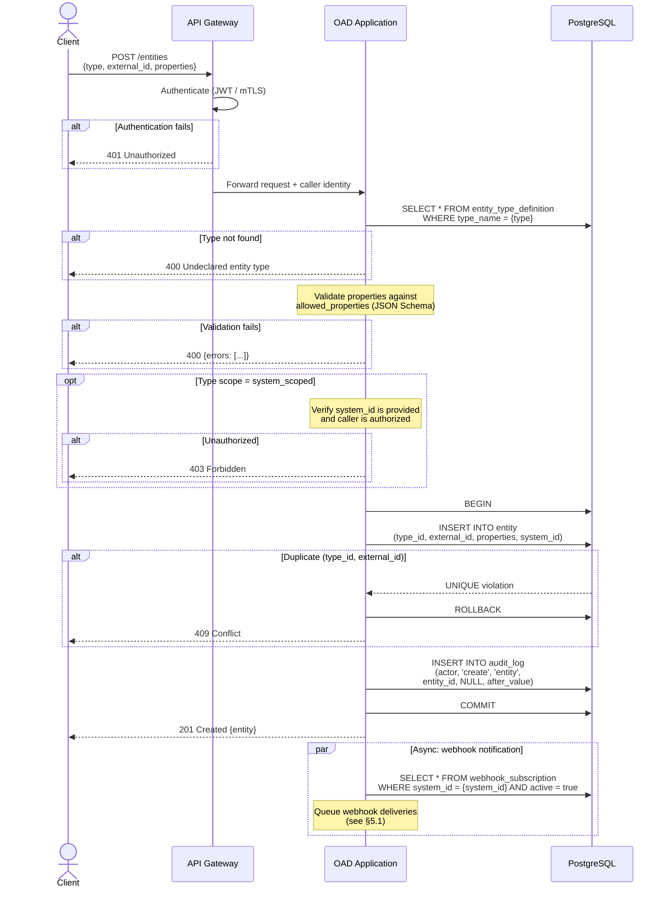

**Requirement traceability:** FR-ENT-001, FR-ENT-002, FR-ENT-003, FR-ENT-008, FR-AUD-001, NFR-SEC-001, NFR-AUD-001.

---

### 2.2 Bulk Import Entities

```mermaid
sequenceDiagram
    actor Client
    participant GW as API Gateway
    participant App as OAD Application
    participant DB as PostgreSQL

    Client->>GW: POST /entities/bulk<br>[{type, external_id, properties}, ...]
    GW->>GW: Authenticate (JWT / mTLS)

    alt Authentication fails
        GW-->>Client: 401 Unauthorized
    end

    GW->>App: Forward request + caller identity

    App->>DB: BEGIN

    loop For each entity in batch
        App->>DB: SELECT * FROM entity_type_definition<br>WHERE type_name = {type}

        alt Type not found
            Note over App: Record failure for this item;<br>continue to next
        else Type found
            Note over App: Validate properties<br>against allowed_properties
            alt Validation fails
                Note over App: Record failure for this item;<br>continue to next
            else Valid
                App->>DB: INSERT INTO entity<br>ON CONFLICT (type_id, external_id)<br>DO UPDATE SET properties, updated_at
                App->>DB: INSERT INTO audit_log
                Note over App: Record success for this item
            end
        end
    end

    App->>DB: COMMIT

    App-->>Client: 200 OK<br>{successes: N, failures: [{index, error}]}

    par Async: webhook notifications
        Note over App: Queue webhook deliveries<br>for affected systems
    end
```

**Requirement traceability:** FR-ENT-007, FR-ENT-003, FR-ENT-008, FR-AUD-001, NFR-PRF-002.

---

### 2.3 Create Relation

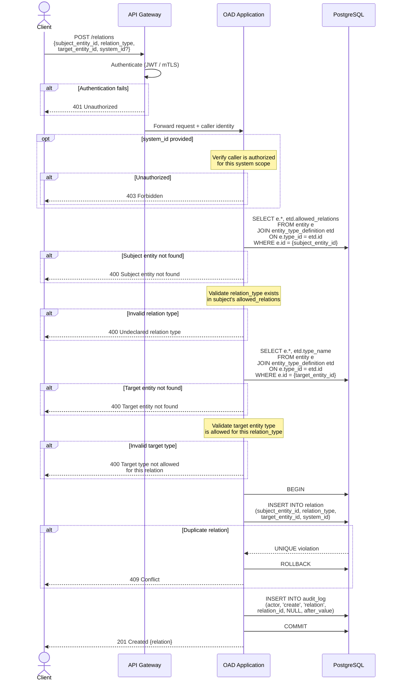

**Requirement traceability:** FR-REL-001, FR-REL-002, FR-REL-003, FR-OVL-005, FR-AUD-001, NFR-SEC-001, NFR-SEC-002.

---

### 2.4 Create Property Overlay

The most validation-intensive ingestion flow. Enforces schema validation and namespace prefixing to prevent attribute pollution and key collisions.

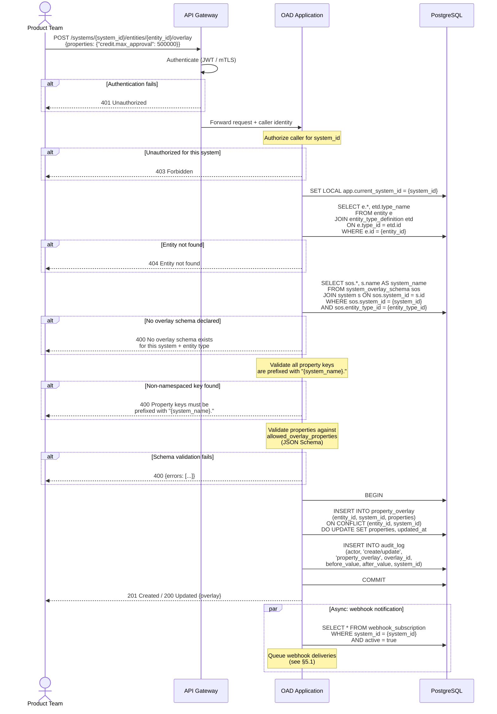

**Requirement traceability:** FR-OVL-001, FR-OVL-002, FR-OVL-003, FR-OVL-004, FR-OVL-008, FR-AUD-001, NFR-SEC-001, NFR-SEC-002.

---

## 3. Retrieval Flows

### 3.1 Entity Lookup (Merged View)

The primary retrieval path for PDPs at policy evaluation time. When a system context is provided, global properties are merged with namespaced overlay properties (disjoint key sets by design), and both global and system-scoped relations are returned.

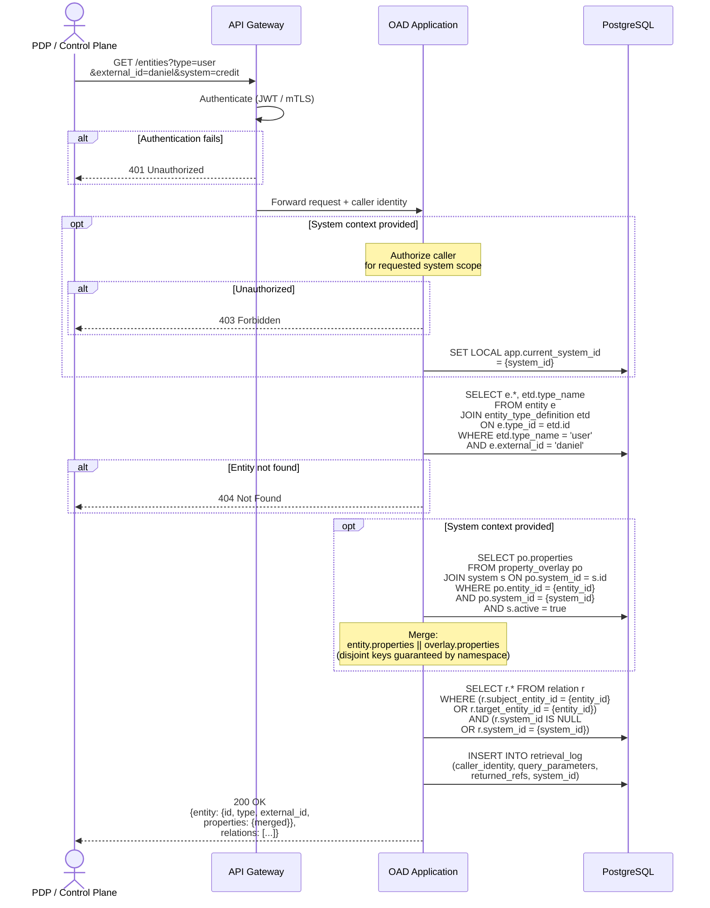

**AuthZen mapping:** The response maps directly to `subject.type` + `subject.id` + `subject.properties` (or `resource.*`) per the AuthZen evaluation request format (spec §4.1).

**Requirement traceability:** FR-RET-001, FR-OVL-006, FR-OVL-007, FR-AUD-002, NFR-PRF-001, NFR-CMP-001.

---

### 3.2 Relation Query

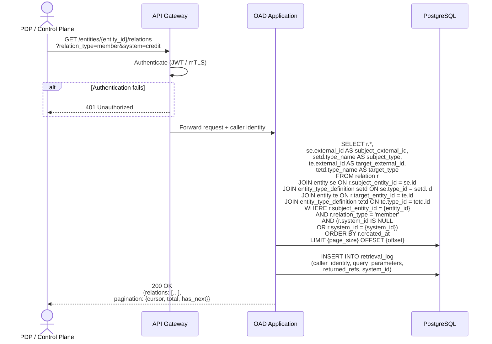

**Requirement traceability:** FR-REL-005, FR-RET-005, FR-AUD-002, NFR-PRF-003.

---

### 3.3 Changelog (Incremental Sync)

Used by PDP control planes to synchronize only changes since their last sync point, avoiding full data reloads.

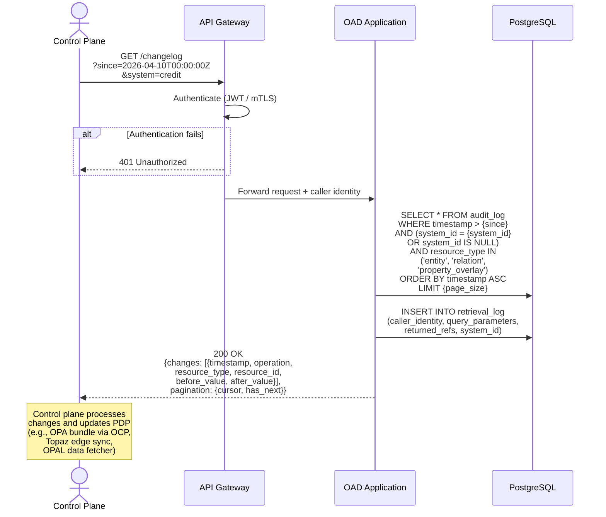

**Requirement traceability:** FR-RET-003, FR-RET-005, FR-AUD-002, NFR-PRF-004.

---

## 4. Administration Flows

### 4.1 Create Entity Type Definition

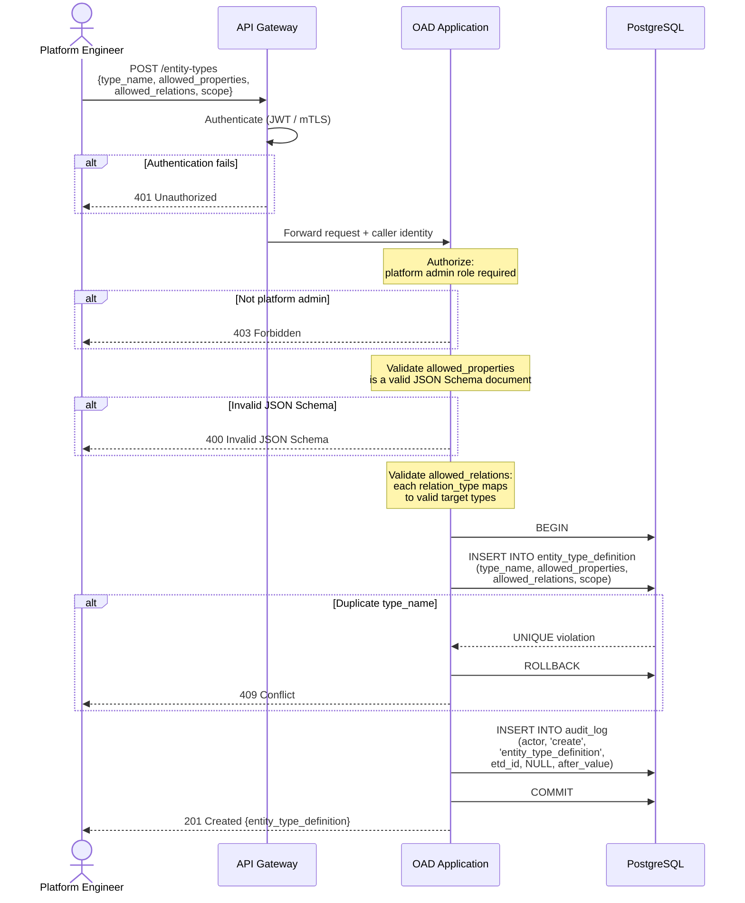

**Requirement traceability:** FR-ETD-001, FR-ETD-004, FR-AUD-001, NFR-EXT-001.

---

### 4.2 Create System Overlay Schema

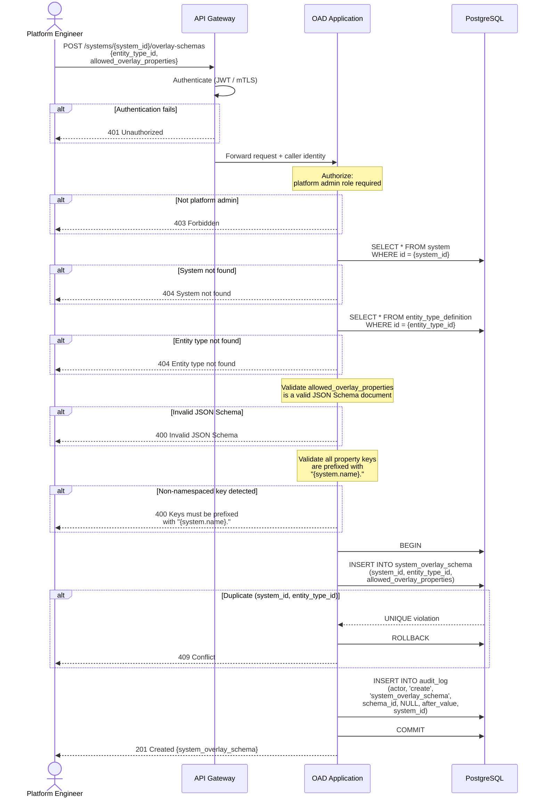

**Requirement traceability:** FR-OVS-001, FR-OVS-004, FR-OVS-005, FR-AUD-001.

---

### 4.3 Register System

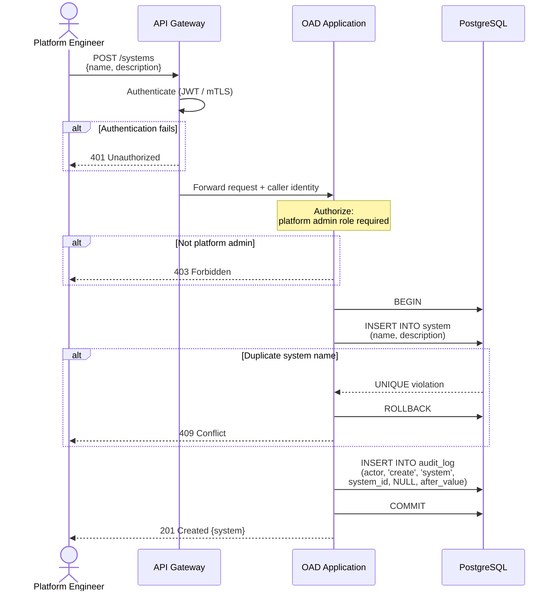

**Requirement traceability:** FR-SYS-001, FR-AUD-001.

---

## 5. Cross-Cutting Flows

### 5.1 Webhook Notification & Delivery

Triggered asynchronously after any write operation that produces an audit log entry.

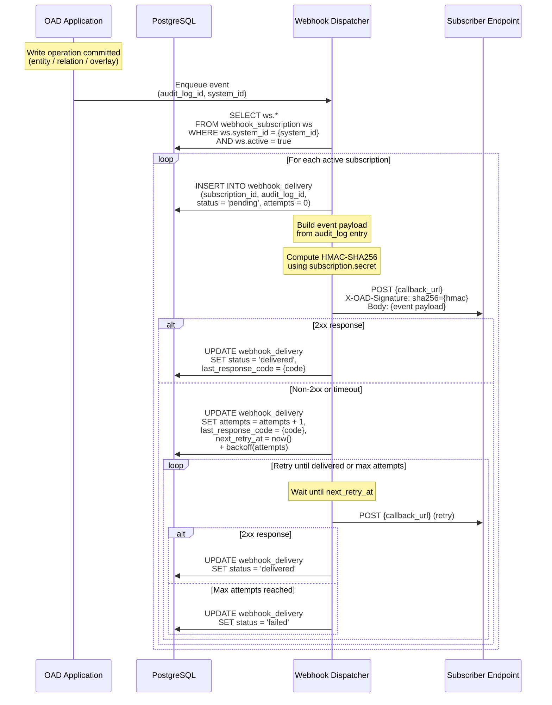

**Exponential backoff:** `delay = base_interval * 2^attempts`, capped at a configurable maximum interval.

**Requirement traceability:** FR-WHK-002, FR-WHK-004.

---

### 5.2 Management UI Authentication & Authorization

The Management UI delegates authentication to an external Identity Provider (OIDC). User roles and system assignments are conveyed as JWT claims, avoiding a circular dependency where OAD would query itself for access control.

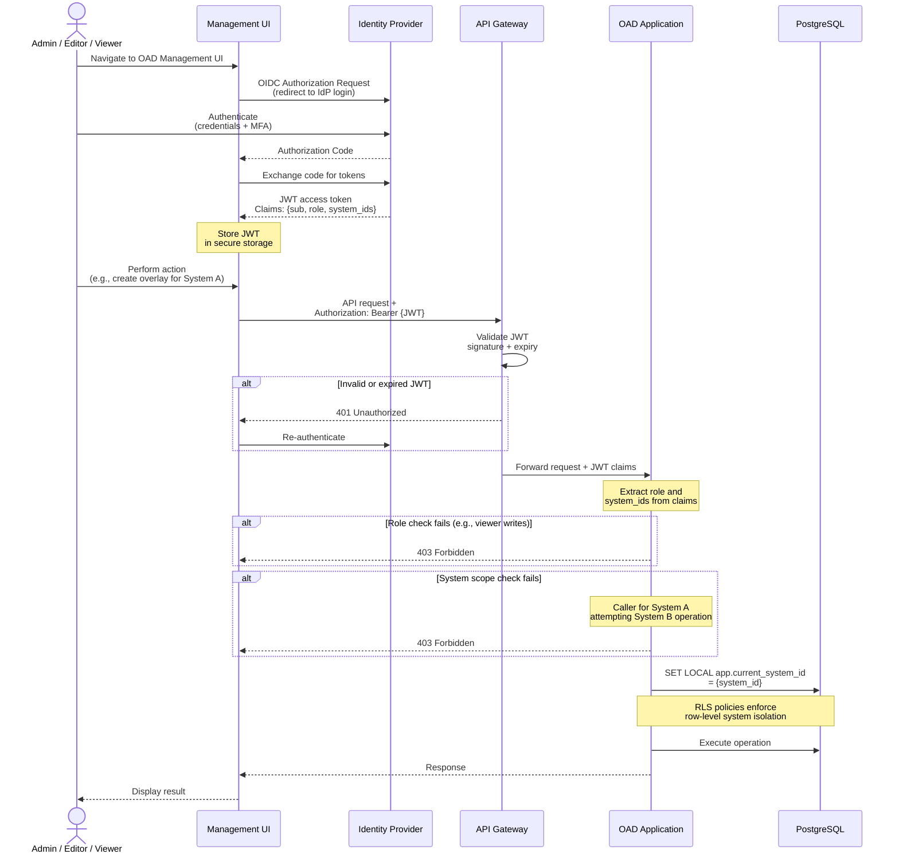

**Requirement traceability:** FR-MGT-001 through FR-MGT-005, NFR-SEC-001, NFR-SEC-002, NFR-SEC-004.

---

## 6. Cross-Cutting Concerns

The following concerns apply to all flows and are enforced consistently across the system:

| Concern | Enforcement | Requirements |
|---|---|---|
| **Transport security** | TLS 1.2+ on all API endpoints; TLS 1.1 and below rejected. | NFR-SEC-005 |
| **Authentication** | Every API call requires JWT or mTLS. Unauthenticated requests receive 401. | NFR-SEC-001 |
| **Authorization** | System-scoped access control on every operation. Caller credentials determine visible systems. | NFR-SEC-002, NFR-SEC-004 |
| **Input validation** | All inputs validated at the API boundary. Parameterized queries for all database operations. | NFR-SEC-003, NFR-SEC-006 |
| **Audit trail** | Every write produces an immutable `audit_log` entry within the same database transaction. Every read produces a `retrieval_log` entry. | NFR-AUD-001, FR-AUD-001, FR-AUD-002 |
| **Row-Level Security** | RLS policies on `entity`, `relation`, `property_overlay`, `webhook_subscription` restrict access by `app.current_system_id` session variable. | NFR-SEC-002 |
| **Structured logging** | JSON-formatted logs with `correlation_id` per request for distributed tracing. | NFR-OPS-002 |
| **Observability** | Prometheus metrics on `/metrics` endpoint: request count, latency histograms (p50 / p95 / p99), error rates. | NFR-OPS-003 |
| **Secrets management** | No secrets in source code or logs. All secrets loaded from environment variables or a secrets manager. | NFR-SEC-007 |

---

## Revision History

| Version | Date | Changes |
|---|---|---|
| 0.1 | 2026-04-10 | Initial draft — use cases (UC-01..15), ingestion flows (entity, bulk import, relation, overlay), retrieval flows (merged view, relation query, changelog), admin flows (type definition, overlay schema, system registration), cross-cutting flows (webhook delivery, UI authentication) |
